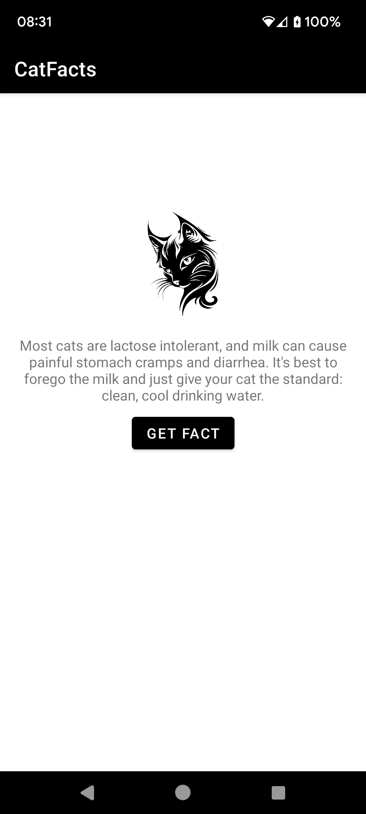

# Cat Facts

This is Udemy [Android Redux/MVI pattern. Tests. Dependency Injection.](https://www.udemy.com/course/android-mvi-pattern-tests-dependency-injection/)  training.

 

## Getting Started

Download the project from [Github](https://github.com/Maniak-pl/CatFacts), the updated branch is **master**

### Dependencies

This project uses the following dependencies

- [ConstraintLayout](https://developer.android.com/training/constraint-layout)
- [Retrofit](https://square.github.io/retrofit/)
- [Moshi](https://github.com/square/moshi)
- [Roxie](https://github.com/ww-tech/roxie)
- [RxJava](https://github.com/ReactiveX/RxJava)
- [RxAndroid](https://github.com/ReactiveX/RxAndroid)
- [Junit4](https://github.com/junit-team/junit4)
- [MockWebServer](https://github.com/square/okhttp/tree/master/mockwebserver)
- [Espresso](https://developer.android.com/training/testing/espresso)

## Screenshots

  